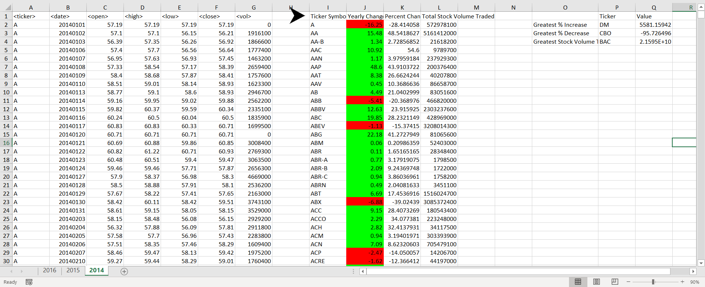
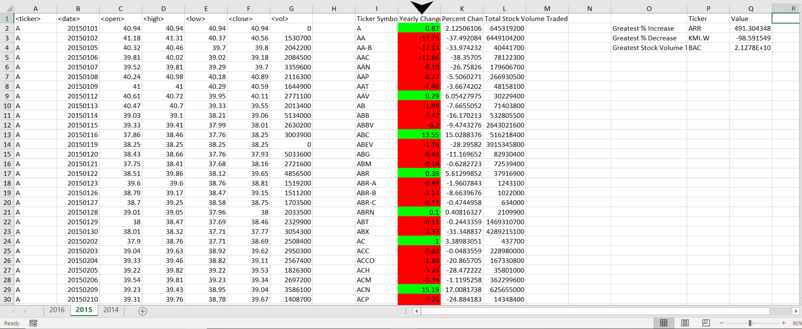
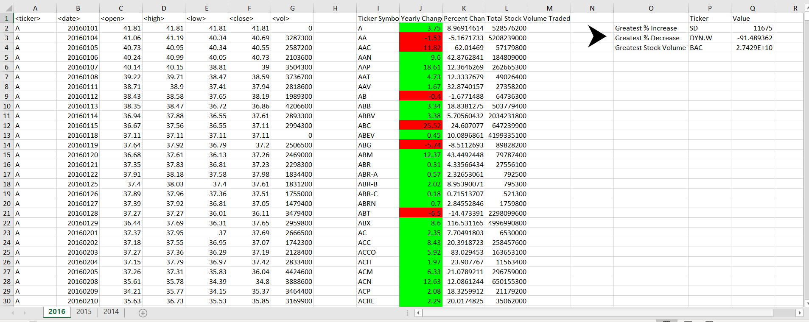

# VBA Assignment

### Stock Market Analysis

In this project we were supposed to be analyst examining stock data.

### Step 1

* Created a script that will loop through each year of stock data and grab the total amount of volume each stock had over the year.

* Displayed the ticker symbol to coincide with the total volume.

### Step 2

* looped through all the stocks to get the following info:

  * Yearly change from what the stock opened the year at to what the closing price was.

  * The percent change from the what it opened the year at to what it closed.

  * The total Volume of the stock

  * Ticker symbol

  * Used conditional formatting to highlight positive change in green and negative change in red.

### Step 3 
  * Located the stock with the "Greatest % increase", "Greatest % Decrease" and "Greatest total volume"

### Step 3

* Made the appropriate adjustments to allow script to run on every worksheet just by running it once.

